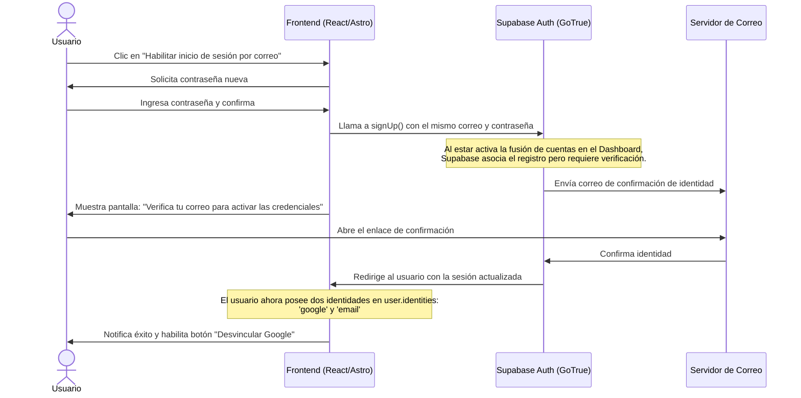

# Plan de Implementación: Flujo Seguro de Identidad de Correo para Usuarios de Google

Este documento detalla el plan arquitectónico y de interfaz para permitir que usuarios registrados originalmente con Google ("Google-First") puedan añadir de forma segura y correcta una identidad de tipo `email` en Supabase Auth, permitiéndoles desvincular Google posteriormente.

---

## 🏛️ Diseño Arquitectónico del Flujo

Para que Supabase registre oficialmente la identidad `email` (y aparezca en `user.identities`), el usuario no puede simplemente cambiar su contraseña de forma pasiva. Debe pasar por un flujo de **verificación y confirmación de correo** iniciado desde la app.



---

## 🛠️ Pasos de Implementación

### Paso 1: Configurar Supabase Dashboard
Antes de modificar el código, se debe verificar que en el panel de control de Supabase (Authentication > Settings):
1. **Link accounts on sign in with same email** esté **Activado** (ON).
2. **Confirm email** esté **Activado** (ON).

---

### Paso 2: Modificar el Componente `SecuritySection.jsx`
Actualmente, el botón para cambiar contraseña en [SecuritySection.jsx](file:///c:/Users/chrys/Documents/GitHub/ChileBite/ChileBIteFront/Recetas/src/features/settings/components/sections/SecuritySection.jsx) simplemente envía un correo de recuperación general (`resetPasswordForEmail`). 

Para usuarios Google-First (identificado cuando `identities.length === 1 && identities[0].provider === 'google'`), el flujo debe cambiar:
1. En lugar de mandar un correo de recuperación directamente, mostrar un formulario que solicite **"Crear una contraseña para tu cuenta"**.
2. Al hacer clic en "Habilitar Correo y Contraseña", el frontend debe ejecutar un registro explícito enlazado:
   ```javascript
   const handleCreateEmailIdentity = async (password) => {
     // Registra al usuario con su correo actual y la contraseña elegida
     const { data, error } = await supabase.auth.signUp({
       email: user.email,
       password: password,
       options: {
         emailRedirectTo: `${window.location.origin}/settings?auth_callback=identity_linked`
       }
     });
     
     if (error) {
       toast.danger(error.message);
     } else {
       toast.success("Te hemos enviado un correo de confirmación. Por favor, valídalo para enlazar tu correo.");
     }
   };
   ```

---

### Paso 3: Capturar el Retorno de Confirmación en la UI
Cuando el usuario haga clic en el correo de confirmación, Supabase lo redirigirá de vuelta a la sección de Configuración (`/settings?auth_callback=identity_linked`).

1. En la página de carga de ajustes (por ejemplo, [SettingsPage.jsx](file:///c:/Users/chrys/Documents/GitHub/ChileBite/ChileBIteFront/Recetas/src/features/settings/components/SettingsPage.jsx)), añadir un `useEffect` para escuchar el parámetro `auth_callback`:
   ```javascript
   useEffect(() => {
     const params = new URLSearchParams(window.location.search);
     if (params.get("auth_callback") === "identity_linked") {
       toast.success("¡Identidad de correo enlazada con éxito! Ya puedes desvincular Google si lo deseas.");
       // Limpiar el parámetro de la URL
       window.history.replaceState({}, document.title, window.location.pathname);
     }
   }, []);
   ```

---

## 📋 Ventajas de este Flujo
* **100% Nativo:** No requiere triggers ni modificaciones directas en el esquema privado `auth` de Postgres.
* **Seguro:** Evita que un tercero pueda asociar una contraseña a una cuenta social sin el consentimiento del dueño del correo.
* **Excelente UX:** El usuario entiende claramente que el correo electrónico es el puente para independizar su cuenta de Google.
